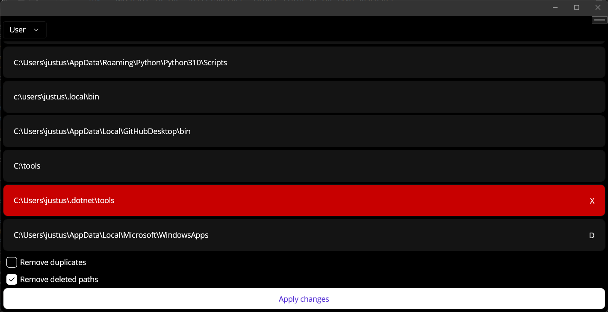

# StreetSweeper
StreetSweeper is a Windows Tool to clean up the $Path variable. It can remove duplicates as well as no longer existing paths.

## Installation
### Installer
TODO

### Compile from Source
- Open a Terminal
- Navigate to the "StreetSweeper" folder (this is the MAUI project)
- In the Terminal run: `dotnet publish -f net6.0-windows10.0.19041.0 -c Release -p:WindowsPackageType=None`
	- [Source](https://github.com/dotnet/maui/issues/7789#issuecomment-1163039011)
- The exe can be found under "./StreetSweeper/StreetSweeper/bin/Release/net6.0-windows10.0.19041.0/win10-x64/publish/"

## Usage
The following features are available:
- Select the environment to modify (Process, User, Machine)
- Inspect all paths in the $Path variable
- Choose if you want to remove duplicates and deleted paths
- Click the button at the bottom to apply the changes

Note: To modify the "Machine" environment you have to start the app as admin.

## License
[MIT](https://choosealicense.com/licenses/mit/)

